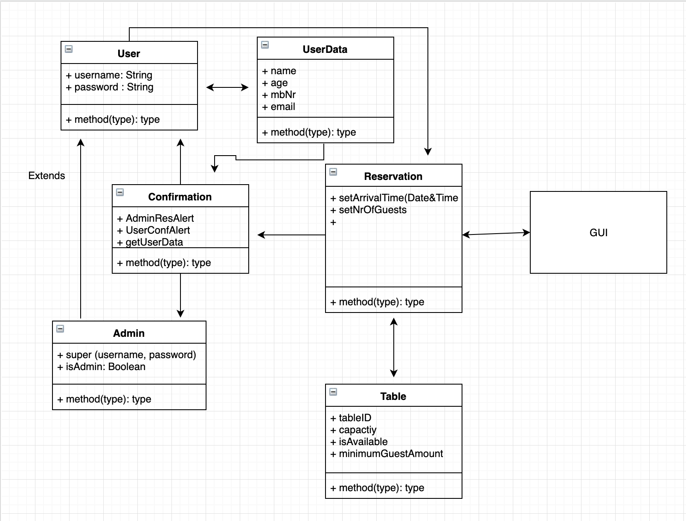

Cucaracha
Se på dette projekt for at få styr på opsætningen af opgaven:
https://github.com/mwndigi/techstack

ALDRIG COMMIT TIL MASTER
Objektorienteret analyse og design

## Analyse:  

En hjemmeside hvorpå man kan reservere et bord (eller flere) efter udfyldelse af personlige kontaktoplysninger og derefter kan man som reserverer vælge et tilgængeligt bord. Kunden bliver først mødt af en velkomstbesked hvorefter kunden bliver navigeret videre til en brugeroprettelsesside eller almindeligt login alt afhængig om kunden allerede er oprettet som bruger i systemet. 
Hvis kunden skal oprette en bruger skal disse udfyldes: 
Fulde navn
Køn
Password
Kontaktoplysninger - kunden er nu oprettet som bruger i systemet og kan logge ind. 
Er kunden allerede oprettet som bruger skal disse udfyldes:
Fulde navn
Password - brugeren kan nu logge ind. 

GUI (Graphical User Interface):
En plantegning af diskoteket hvor de ledige borde vil lyse grøn og de ikke ledige borde vil lyse rødt. Brugeren kan vælge dato og tidspunkt for ankomst, og kan derved filtrere listen af borde. Kunderne er omverdenen og altså personer som gerne vil ud i Københavns natteliv og have et bord at sidde ved på Cucaracha bar.  

Hvis bordet lyser grøn og brugeren vælger dét bord kan bordet forespørges via. brugeren hvor der automatisk vil blive sendt en forespørgsel til Cucarrachas administration/ansvarlige, hvorefter de så kan bekræfte forespørgslen og tildele de forespørgende det ønskede bord. 

 
Bekræftelse:
Allerførst skal brugeren bekræfte bestillingen, hvorefter Cucarachas admin profil vil modtage forespørgslen. Når så adminprofilen har bekræftet forespørgslen og gjort det til en godkendt bestilling vil brugeren modtage en alert på siden. 
 
Design:

Første step er, at brugeren går ind på Cucarachas hjemmeside og oppe i navigation barren vælger brugeren så “Book et bord” og kommer derfor over til en ny side hvor brugeren logger ind eller opretter bruger. Næste step er udfyldningen af personlige kontaktoplysninger, som vil bestå af diverse bokse hvori der skal udfyldes oplysninger.

Baseret på tekniske konstruktioner bliver brugeren så navigeret hen til en plantegning af diskoketet, som er set fra et fugleperspektiv hvori alle borde som ledige og såvel ikke ledige borde vil være visualiseret. De borde som lyser grøn vil være tilgængelige og de som lyser rødt vil være utilgængelige. Baren vil også være visuel på plantegningen så brugeren ved hvor bordene er placeret i forhold til denne. 
Slutteligt vil Cucaracha modtage forespørgslen, vurdere den og oplyse brugeren og fortælle om bordet blev reserveret. 

### Kort beskrivelse :
En hjemmeside hvorpå man kan reservere et bord (eller flere) efter udfyldelse af personlige kontaktoplysninger og derefter kan man som kunde/ vælge et tilgængeligt bord. 

# Kravspecifikation 
#### Login side:
  1. Velkomstbesked
  2. Login kræver at kunden har oprettet bruger
  3. Opret bruger- hvis kunden ikke har gjort det endnu
#### Opret bruger:
  1. Fulde navn
  2. Køn
  3. Password
  
#### GUI:
  1. Brugeren ser en oversigt over borde med angivelse af ledighed ved hvert bord
  2. Brugeren kan vælge dato og tidspunkt for ankomst, og kan derved filtere listen af borde
  3. Brugeren kan vælge et bord som personen ønsker at booke
#### Bekræftelse:
  1. Brugeren skal bekræfte bestillingen.
  2. Sender bestilling til Cucarachas admin profil
#### Admin profil :
 1. Login- en master bruger som alle Cucarachas ansatte logger ind på
 2. Ser bekræftede bestillinger og persondata på bestillinger- også gennem GUI'en
 3. Bekræfte eller afvise nye bestillinger- besked til bruger profil.
 
 # Klassediagram

